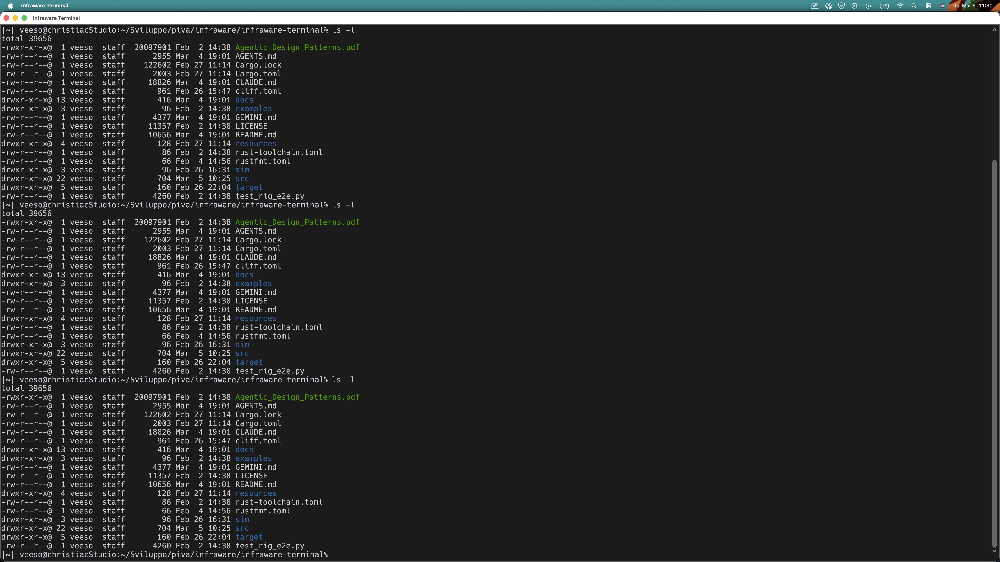

# Infraware Terminal

[](https://opensource.org/licenses/Apache-2.0)
[](https://github.com/Infraware-dev/infraware-terminal/actions/workflows/rust-ci.yml)
[](https://www.rust-lang.org/)

An AI-native terminal for cloud infrastructure operations
Prefix any command with `?` to ask questions in natural language.

> **Early Stage**: This project is under active development. APIs, features, and behavior may change
> without notice. Contributions and feedback are welcome!



## Features

- **Natural language queries** -- prefix any command with `?` to ask the AI agent
  (e.g., `? how do I revert the last git commit`)
- **Human-in-the-loop** -- the agent proposes shell commands for your approval before executing them
- **Incident investigation pipeline** -- structured multi-phase investigation with post-mortem reports and
  remediation plans
- **Tabbed terminal** -- multiple tabs and split panes via `egui_tiles`
- **VTE terminal emulation** -- full ANSI/xterm-256color support
- **Docker sandbox** -- optionally run commands inside a disposable Docker container
- **Arena mode** -- incident investigation challenges in preconfigured Docker environments
- **Session memory** -- the agent remembers facts about you and your environment across sessions

## Quick Start

### Prerequisites

- **Rust** 1.88+ (edition 2024)
- **Anthropic API key** (for the default Rig engine)

**Linux only:**

```bash
sudo apt install -y pkg-config libssl-dev libxcb-shape0-dev libxcb-xfixes0-dev
```

### Build and Run

```bash
git clone https://github.com/Infraware-dev/infraware-terminal.git
cd infraware-terminal

# Copy the example env file and add your API key
cp .env.example .env
# Edit .env and set ANTHROPIC_API_KEY=sk-...

# Run (uses the Rig engine by default)
cargo run

# Or pass the API key directly
cargo run -- --api-key sk-...

# Or try with the mock engine (no API key needed)
ENGINE_TYPE=mock cargo run
```

### Use the AI Assistant

In the terminal, prefix with `?` for natural language queries:

```
? show me running Docker containers
? list files larger than 100MB in this directory
? how do I revert the last git commit
```

The agent will propose commands for your approval before running them.

## Configuration

Configuration is done via environment variables (or a `.env` file). See [`.env.example`](.env.example) for all options.

| Variable | Default | Description |
|----------|---------|-------------|
| `ENGINE_TYPE` | `rig` | Engine backend: `rig` or `mock` |
| `ANTHROPIC_API_KEY` | -- | Anthropic API key (required for `rig`) |
| `ANTHROPIC_MODEL` | `claude-sonnet-4-20250514` | Model to use |
| `RIG_MAX_TOKENS` | `4096` | Max tokens per response |
| `RIG_TEMPERATURE` | `0.7` | Sampling temperature |
| `RIG_TIMEOUT_SECS` | `300` | Request timeout in seconds |
| `MEMORY_PATH` | `./.infraware/memory.json` | Persistent memory storage path |
| `MEMORY_LIMIT` | `200` | Max memory entries (FIFO eviction) |
| `LOG_LEVEL` | `info` | Log level: `debug`, `info`, `warn`, `error` |

### CLI Flags

```bash
cargo run -- --api-key <KEY>                    # Pass API key directly
cargo run -- --log-level debug                  # Set log level

# Docker sandbox (requires pty-test_container feature)
cargo run --features pty-test_container -- --use-pty-test-container
cargo run --features pty-test_container -- --use-pty-test-container --pty-test-container-image ubuntu:24.04

# Arena mode (requires arena feature)
cargo run --features arena -- --arena the-502-cascade
```

## Keyboard Shortcuts

| Shortcut | Action | Platform |
|----------|--------|----------|
| `Cmd+T` / `Ctrl+Shift+T` | New tab | macOS / Linux |
| `Cmd+W` / `Ctrl+Shift+W` | Close tab | macOS / Linux |
| `Ctrl+Tab` | Next tab | All |
| `Ctrl+Shift+Tab` | Previous tab | All |
| `Cmd+Shift+H` / `Ctrl+Shift+H` | Split horizontal | macOS / Linux |
| `Cmd+Shift+J` / `Ctrl+Shift+J` | Split vertical | macOS / Linux |
| `Cmd+C` / `Ctrl+Shift+C` | Copy | macOS / Linux |
| `Cmd+V` / `Ctrl+Shift+V` | Paste | macOS / Linux |
| `Ctrl+C` | SIGINT (interrupt) | All |
| `Ctrl+D` | EOF | All |
| `Ctrl+L` | Clear screen | All |
| `Ctrl+Shift+/` | Enter LLM mode | All |

## Architecture

Infraware Terminal is a single Rust binary that combines a GPU-accelerated terminal emulator (egui/eframe)
with an in-process agentic LLM engine.

```
+---------------------------------------------------+
| infraware-terminal                                |
|                                                   |
|  +-------------+     +------------------------+  |
|  | Terminal UI  |     | AgenticEngine (trait)  |  |
|  | (egui)      |<--->| +--------+ +---------+ |  |
|  +------+------+     | | Mock   | | Rig     | |  |
|         |            | | Engine | | Engine  | |  |
|    +----v----+       | +--------+ +----+----+ |  |
|    |   PTY   |       +----------------+-------+  |
|    | Session |                        |           |
|    +----+----+                        |           |
|    +----v----+                 +------v------+    |
|    |  VTE    |                 | Anthropic   |    |
|    | Parser  |                 | API         |    |
|    +---------+                 +-------------+    |
+---------------------------------------------------+
```

For a detailed architecture description, see [docs/architecture.md](docs/architecture.md).

## Documentation

| Document | Description |
|----------|-------------|
| [Architecture](docs/architecture.md) | System architecture and module overview |
| [PTY Backends](docs/pty-backends.md) | Pluggable PTY backend system |
| [Memory System](docs/memory-system.md) | Persistent and session memory |
| [Incident Investigation](docs/incident-investigation.md) | Multi-phase incident investigation pipeline |
| [Arena Mode](docs/arena-mode.md) | Incident investigation challenges |
| [Contributing](CONTRIBUTING.md) | How to contribute |

## Feature Flags

| Feature | Description |
|---------|-------------|
| `rig` *(default)* | Anthropic Claude agent via rig-rs |
| `docker` | Base Docker support (bollard) |
| `pty-test_container` | Docker container PTY sandbox |
| `arena` | Arena incident investigation challenges |

## Development

```bash
cargo build                          # Build
cargo test                           # Run tests
cargo +nightly fmt --all             # Format (requires nightly for rustfmt.toml rules)
cargo clippy -- -D warnings          # Lint (CI-strict mode)
cargo watch -x run                   # Watch mode (requires cargo-watch)
LOG_LEVEL=debug cargo run            # Run with debug logging
```

## Contributing

See [CONTRIBUTING.md](CONTRIBUTING.md) for guidelines.

## License

Licensed under the [Apache License, Version 2.0](LICENSE).

Copyright 2026 Infraware S.R.L.
