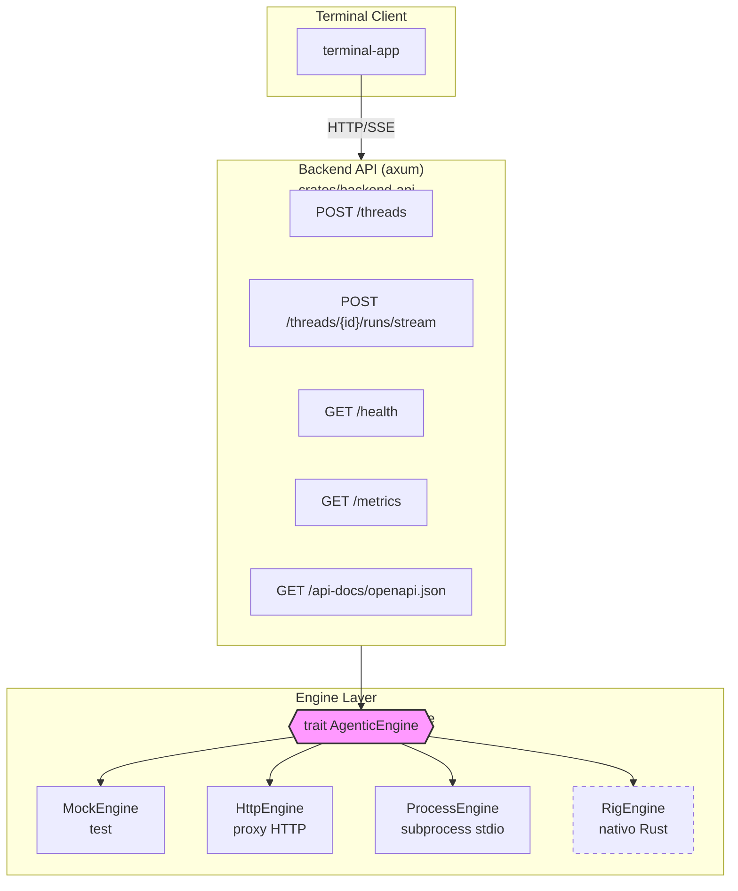
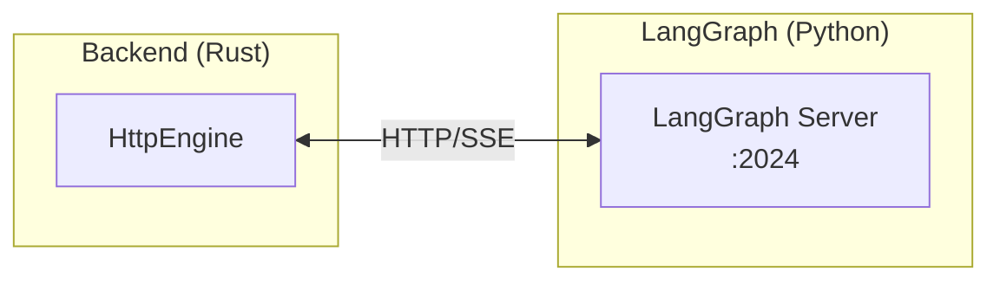
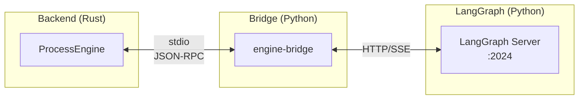
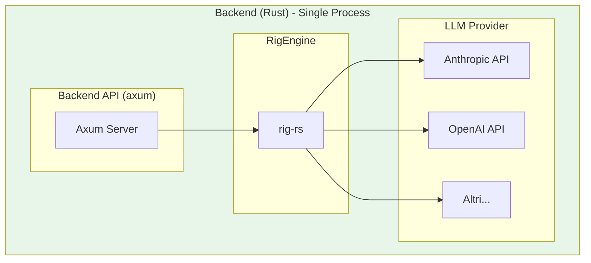
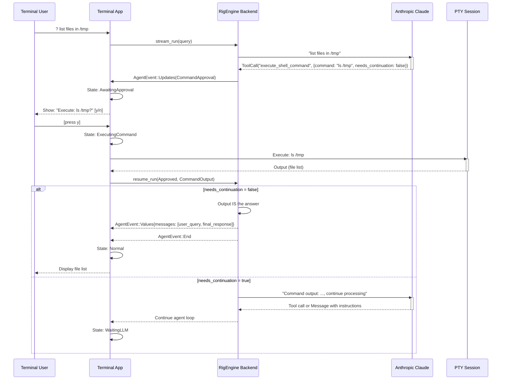
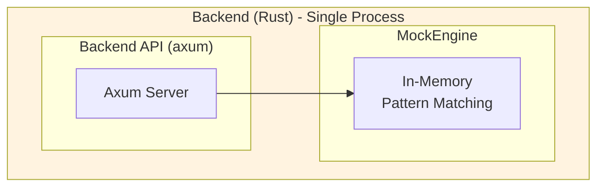
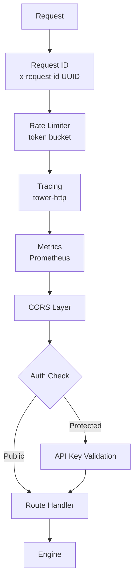
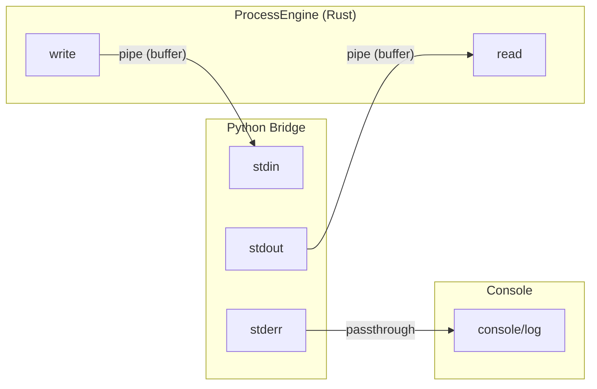
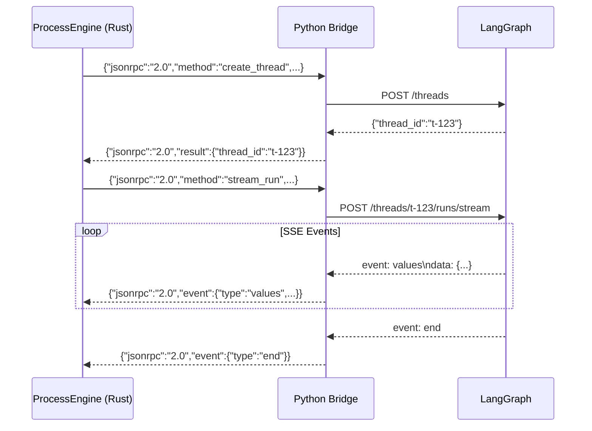
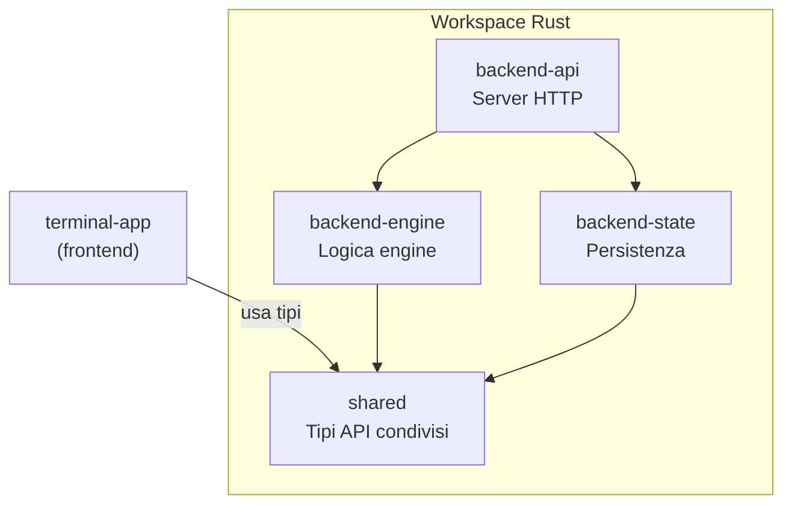

# Backend Architecture

> ## ⚠️ NOTA: Diagrammi Mermaid
>
> Questo documento contiene diagrammi in formato **Mermaid**.
>
> - **GitHub/GitLab**: I diagrammi vengono renderizzati automaticamente
> - **VS Code**: Installa l'estensione "Markdown Preview Mermaid Support"
> - **IntelliJ/RustRover**: Installa il plugin "Mermaid" dal Marketplace
> - **Obsidian**: Supporto nativo
>
> Senza plugin, vedrai il codice sorgente dei diagrammi invece dei grafici.

---

Questo documento descrive l'architettura del backend Rust di Infraware Terminal, le opzioni di integrazione disponibili e i relativi pro/contro.

## Panoramica

Il backend è progettato con un'architettura modulare che permette di collegare diversi "motori agentici" (agentic engines) senza modificare il codice dell'API.



## Il Trait AgenticEngine

Tutte le implementazioni condividono questa interfaccia:

```rust
#[async_trait]
pub trait AgenticEngine: Send + Sync + Debug {
    /// Crea un nuovo thread di conversazione
    async fn create_thread(&self, metadata: Option<Value>) -> Result<ThreadId, EngineError>;

    /// Avvia un run con streaming di eventi
    async fn stream_run(&self, thread_id: &ThreadId, input: RunInput) -> Result<EventStream, EngineError>;

    /// Riprende dopo un interrupt HITL (Human-in-the-Loop)
    async fn resume_run(&self, thread_id: &ThreadId, response: ResumeResponse) -> Result<EventStream, EngineError>;

    /// Verifica lo stato di salute dell'engine
    async fn health_check(&self) -> Result<HealthStatus, EngineError>;
}
```

## Tipi di Eventi

Gli engine producono un stream di `AgentEvent`:

```rust
pub enum AgentEvent {
    Metadata { run_id: String },           // Inizio run
    Message(MessageEvent),                  // Chunk di messaggio (streaming)
    Values { messages: Vec<Message> },      // Stato completo messaggi
    Updates { interrupts: Option<Vec<Interrupt>> },  // Interrupt HITL
    Error { message: String },              // Errore
    End,                                    // Fine stream
}

pub enum Interrupt {
    CommandApproval { command: String, message: String },  // Richiede approvazione comando
    Question { question: String, options: Option<Vec<String>> },  // Domanda all'utente
}
```

---

## Opzioni di Integrazione

### Opzione 1: HttpEngine (Proxy Diretto)



**Come funziona:**
- Il backend Rust fa richieste HTTP direttamente a LangGraph
- Le risposte SSE vengono parsificate e convertite in `AgentEvent`
- Nessun processo intermedio

**Configurazione:**
```bash
ENGINE_TYPE=http
LANGGRAPH_URL=http://localhost:2024
```

**Pro:**
- Semplice: un solo hop di rete
- Bassa latenza
- Meno componenti da gestire
- Facile da debuggare

**Contro:**
- Accoppiamento diretto con LangGraph
- Se LangGraph cambia API, devi modificare HttpEngine
- Nessun isolamento di processo

**Quando usarlo:**
- Produzione standard con LangGraph
- Quando vuoi semplicità e performance
- Deployment su stessa macchina o rete locale

---

### Opzione 2: ProcessEngine + Bridge (Subprocess)



**Come funziona:**
- Il backend Rust spawna un subprocess Python
- Comunicazione via stdin/stdout con protocollo JSON-RPC
- Il bridge traduce JSON-RPC in chiamate HTTP a LangGraph

**Configurazione:**
```bash
ENGINE_TYPE=process
LANGGRAPH_URL=http://localhost:2024
BRIDGE_COMMAND=python3
BRIDGE_SCRIPT=bin/engine-bridge/main.py
```

**Pro:**
- Isolamento: il bridge è un processo separato
- Flessibilità: puoi scrivere bridge per sistemi diversi
- Restart indipendente: puoi riavviare il bridge senza toccare Rust
- Linguaggio: il bridge può essere in qualsiasi linguaggio

**Contro:**
- Overhead: hop aggiuntivo (Rust → Bridge → LangGraph)
- Complessità: più componenti da gestire
- Latenza: leggermente maggiore
- Debug: più difficile tracciare problemi

**Quando usarlo:**
- Quando vuoi isolare la comunicazione con l'agente
- Per integrare sistemi non-HTTP (es. gRPC, WebSocket)
- Quando hai logica custom da eseguire nel bridge
- Per testing con mock bridge

---

### Opzione 3: RigEngine (Nativo Rust) - Implementato



**Come funziona:**
- Tutto in un unico processo Rust
- rig-rs gestisce la logica agentica con function calling nativo
- Strumenti registrati: ShellCommandTool, AskUserTool
- PromptHook intercetta le tool call per HITL (Human-in-the-Loop)
- needs_continuation flag distingue tra comandi con risposta diretta vs quelli che richiedono continuazione
- Chiamate dirette all'API del provider LLM (Anthropic Claude)

**Configurazione:**
```bash
ENGINE_TYPE=rig
ANTHROPIC_API_KEY=sk-...
```

**Pro:**
- Performance massima: nessun overhead di rete interna, nessun subprocess
- Type-safe: tutto compilato insieme
- Semplicità deployment: un solo binario
- Memoria condivisa: nessuna serializzazione tra componenti
- HITL integrato: PromptHook intercetta le tool call per approvazione utente
- needs_continuation flag: intelligente routing tra risposte dirette e agentive
- Scalabilità: nessun server LangGraph da gestire

**Contro:**
- Meno flessibile: devi ricompilare per cambiare logica
- Lock-in Rust: la logica agentica deve essere in Rust
- Maturità: rig-rs 0.28 è giovane, API potrebbe cambiare

**Quando usarlo (consigliato per):**
- Uso primario: migliore bilanciamento tra performance, semplicità e features
- Deployment su macchine singole o cluster Kubernetes
- Quando HITL e intelligenza di continuazione sono importanti
- Se non hai bisogno di usare LangGraph

---

## needs_continuation Flag

The `needs_continuation` flag is a critical feature that controls how the RigEngine handles command output after user approval.

### What It Means

When the agent proposes a shell command, it sets `needs_continuation` to indicate whether the output should be:

- **false** (default): Output IS the final answer to the user's query
  - Example: `ls -la` → list files → done
  - Example: `whoami` → show current user → done
  - The agent doesn't need to see the output; terminal shows it directly

- **true**: Output is INPUT for the agent to continue reasoning
  - Example: `uname -s` → get OS → then provide OS-specific instructions
  - Example: `node --version` → get version → then suggest upgrade if outdated
  - The agent receives the output and continues the conversation

### Why It Matters

This flag allows the agent to distinguish between:
1. **Query commands** (output is the answer): "list files", "show my username"
2. **Decision commands** (output guides next steps): "detect OS", "check Python version", "see if service is running"

### Implementation Details

**In Interrupt (crates/shared/src/events.rs):**
```rust
pub enum Interrupt {
    CommandApproval {
        command: String,
        message: String,
        needs_continuation: bool,  // <-- This field
    },
    // ...
}
```

**In Tool Args (crates/backend-engine/src/adapters/rig/tools/shell.rs):**
```rust
pub struct ShellCommandArgs {
    pub command: String,
    pub explanation: String,
    pub needs_continuation: bool,  // <-- LLM sets this
}
```

**In Resume Flow (crates/backend-engine/src/adapters/rig/orchestrator.rs):**
```rust
match resume_response {
    ResumeResponse::Approved => {
        let output = execute_command(&command).await;

        if needs_continuation {
            // Send output back to LLM for further processing
            agent.continuation(output).await
        } else {
            // Output IS the answer - return directly to user
            emit_final_response(output).await
        }
    }
}
```

## RigEngine Execution Flow with needs_continuation

The `needs_continuation` flag enables intelligent command handling in RigEngine:

### Sequence Diagram: RigEngine HITL with needs_continuation



### Example Scenarios

**Scenario 1: Direct Answer (needs_continuation=false)**
```
User: "List all Python files"
  ↓
Agent: execute_shell_command("find . -name '*.py'", needs_continuation=false)
  ↓
[User approves execution in PTY]
  ↓
Output: "file1.py file2.py file3.py"
  ↓
Agent: [Output is the complete answer - return directly to user]
  ↓
User sees: The list of Python files
```

**Scenario 2: Processing Needed (needs_continuation=true)**
```
User: "Help me setup Node.js with the right version"
  ↓
Agent: execute_shell_command("node --version", needs_continuation=true)
  ↓
[User approves execution in PTY]
  ↓
Output: "v14.21.0"
  ↓
Agent receives version and continues:
  "I see you have Node v14. Let me help you upgrade to v18..."
  ↓
Agent: execute_shell_command("nvm install 18", needs_continuation=true)
  ↓
[User approves]
  ↓
Agent continues with next steps based on output...
```

**Scenario 3: Question Handling (No Command)**
```
User: "Help me install Redis"
  ↓
Agent: AskUserTool("Which Linux distribution?", options=["Ubuntu", "Debian", "CentOS"])
  ↓
Terminal: State: AwaitingAnswer
  ↓
User: [Select "Ubuntu"]
  ↓
Agent: [Receives answer and continues with Ubuntu-specific instructions]
```

---

### Opzione 4: MockEngine (Test/Demo)



**Come funziona:**
- Risposte simulate in-memory
- Pattern matching su input (es. "docker" → risposta docker)
- Simula anche interrupt HITL

**Configurazione:**
```bash
ENGINE_TYPE=mock
```

**Pro:**
- Zero dipendenze esterne
- Velocissimo
- Deterministico
- Ottimo per CI/CD

**Contro:**
- Non è un vero agente
- Risposte statiche

**Quando usarlo:**
- Test unitari e integrazione
- Sviluppo UI senza backend
- Demo e prototipi

---

## Tabella Comparativa

| Aspetto | HttpEngine | ProcessEngine | RigEngine | MockEngine |
|---------|------------|---------------|-----------|------------|
| **Status** | Stabile | Stabile | Implementato (primary) | Testing |
| **Latenza** | Bassa | Media | Minima | Minima |
| **Complessità** | Bassa | Media | Bassa | Minima |
| **Isolamento** | No | Sì | No | N/A |
| **Flessibilità** | Media | Alta | Media | Bassa |
| **Debug** | Facile | Medio | Facile | Facile |
| **HITL** | LangGraph-based | LangGraph-based | Native PromptHook | Simulato |
| **needs_continuation** | No | No | Sì | Sì |
| **Deployment** | 2 processi | 3 processi | 1 processo | 1 processo |
| **Dipendenze** | LangGraph | LangGraph + Bridge | rig-rs 0.28+ | Nessuna |

---

## Sicurezza e Middleware

Il backend include diversi layer di sicurezza e middleware per la produzione.

### Stack Middleware



### Autenticazione

- **Endpoint protetti**: `/threads/*` richiedono API key
- **Endpoint pubblici**: `/health`, `/metrics`, `/api-docs/*`

Header supportati:
```http
Authorization: Bearer <api-key>
X-Api-Key: <api-key>
```

### Rate Limiting

Implementazione token bucket con sliding window:
- **Configurabile** via `RATE_LIMIT_RPM` (requests per minute)
- **Default**: 100 req/min
- **Risposta**: `429 Too Many Requests` quando superato

### CORS

Configurazione flessibile:
- **Sviluppo**: `ALLOWED_ORIGINS=*` (permissivo)
- **Produzione**: Lista esplicita `ALLOWED_ORIGINS=https://app.example.com,https://admin.example.com`

---

## Observability

### OpenAPI Documentation

Specifica OpenAPI 3.0 generata automaticamente con **utoipa**:

```bash
# Recupera spec JSON
curl http://localhost:8080/api-docs/openapi.json
```

Annotazioni nei route handler:
```rust
#[utoipa::path(
    post,
    path = "/threads",
    tag = "threads",
    request_body = CreateThreadRequest,
    responses(
        (status = 200, body = CreateThreadResponse),
        (status = 401, description = "Unauthorized"),
    ),
    security(("api_key" = []))
)]
pub async fn create_thread(...) { ... }
```

### Request Tracing

Ogni richiesta riceve un UUID unico:

```
Request:  X-Request-Id: (generato se assente)
Response: X-Request-Id: 550e8400-e29b-41d4-a716-446655440000
```

Utile per:
- Correlare log tra client e server
- Debug di problemi specifici
- Audit trail

### Prometheus Metrics

Endpoint: `GET /metrics`

Metriche esposte:
```
# Counter: richieste totali
http_requests_total{method="POST",path="/threads",status="200"} 42

# Histogram: latenza richieste (secondi)
http_request_duration_seconds_bucket{method="GET",path="/health",status="200",le="0.01"} 100
http_request_duration_seconds_sum{...} 0.523
http_request_duration_seconds_count{...} 150
```

Bucket configurati per latenze tipiche:
`[0.005, 0.01, 0.025, 0.05, 0.1, 0.25, 0.5, 1.0, 2.5, 5.0, 10.0]` secondi

---

## Comunicazione Stdio

### Cos'è Stdio?

**stdio** sta per "standard input/output" - i canali di comunicazione standard di Unix:

| Canale | File Descriptor | Direzione | Uso |
|--------|-----------------|-----------|-----|
| **stdin** | 0 | Input | Leggere dati |
| **stdout** | 1 | Output | Scrivere dati |
| **stderr** | 2 | Output | Scrivere errori/log |

Quando un processo ne spawna un altro, può "agganciare" questi canali con delle **pipe**:



### Sequenza di Comunicazione



### Come Funziona in Rust

```rust
// crates/backend-engine/src/ipc/stdio.rs

use tokio::process::{Child, Command};
use tokio::io::{AsyncBufReadExt, AsyncWriteExt};

pub struct StdioTransport {
    child: Option<Child>,           // Il processo figlio
    stdin: Option<ChildStdin>,      // Pipe per SCRIVERE al processo
    response_rx: Receiver<...>,     // Canale per ricevere risposte parsificate
}

impl StdioTransport {
    pub async fn spawn(&mut self) -> Result<(), EngineError> {
        let mut cmd = Command::new(&self.config.command);
        cmd.args(&self.config.args)
            .stdin(Stdio::piped())    // Cattura stdin
            .stdout(Stdio::piped())   // Cattura stdout
            .stderr(Stdio::inherit()); // Lascia passare stderr per debug

        let mut child = cmd.spawn()?;

        // Prendi possesso delle pipe
        let stdin = child.stdin.take();   // Per scrivere
        let stdout = child.stdout.take(); // Per leggere

        // Task separato che legge stdout e parsifica JSON
        tokio::spawn(async move {
            let reader = BufReader::new(stdout);
            let mut lines = reader.lines();
            while let Some(line) = lines.next_line().await? {
                let response = serde_json::from_str(&line)?;
                tx.send(response).await;
            }
        });

        self.child = Some(child);
        self.stdin = Some(stdin);
    }

    pub async fn send(&self, request: &JsonRpcRequest) -> Result<(), EngineError> {
        let json = serde_json::to_string(request)? + "\n";
        self.stdin.write_all(json.as_bytes()).await?;
        self.stdin.flush().await?;
    }
}
```

### Come Funziona in Python (Bridge)

```python
# bin/engine-bridge/main.py
import sys
import json

# Legge da stdin (una riga JSON alla volta)
for line in sys.stdin:
    request = json.loads(line)

    # Elabora la richiesta...
    result = process_request(request)

    # Scrive su stdout
    print(json.dumps(result), flush=True)  # flush=True è importante!

# Stderr per debug (non interferisce col protocollo)
print("Debug message", file=sys.stderr)
```

### Perché Usare Stdio?

| Vantaggio | Spiegazione |
|-----------|-------------|
| **Universale** | Funziona con qualsiasi linguaggio |
| **Semplice** | Nessun setup di rete, socket, o protocolli complessi |
| **Isolato** | Il subprocess ha il suo spazio di memoria |
| **Streaming** | Le pipe supportano flusso continuo di dati |
| **Sicuro** | Nessuna porta aperta, nessun accesso di rete |

### Differenza da HTTP

| Aspetto | HTTP | Stdio |
|---------|------|-------|
| **Trasporto** | TCP/IP (rete) | Pipe (kernel) |
| **Overhead** | Headers, TLS, routing | Minimo |
| **Latenza** | ms (rete) | μs (memoria) |
| **Setup** | Server + porta | Spawn processo |
| **Scope** | Rete/Internet | Solo locale |

### Formato Messaggi (Line-Delimited JSON)

Ogni messaggio è una singola riga JSON terminata da `\n`:

```
{"jsonrpc":"2.0","id":"1","method":"health_check"}\n
{"jsonrpc":"2.0","id":"2","method":"create_thread","params":{}}\n
```

Questo formato si chiama **NDJSON** (Newline Delimited JSON) o **JSON Lines**.

**Perché line-delimited?**
- Facile da parsificare (leggi fino a `\n`)
- Supporta streaming
- Ogni riga è indipendente

---

## Protocollo JSON-RPC (ProcessEngine)

Il ProcessEngine comunica col bridge usando JSON-RPC 2.0 su stdio.

### Request (Rust → Bridge)

```json
{"jsonrpc":"2.0","id":"req-1","method":"create_thread","params":{"metadata":null}}
{"jsonrpc":"2.0","id":"req-2","method":"stream_run","params":{"thread_id":"t-123","input":{"messages":[...]}}}
{"jsonrpc":"2.0","id":"req-3","method":"resume_run","params":{"thread_id":"t-123","response":{"approved":true}}}
{"jsonrpc":"2.0","id":"req-4","method":"health_check","params":{}}
```

### Response (Bridge → Rust)

```json
// Risultato finale
{"jsonrpc":"2.0","id":"req-1","result":{"thread_id":"t-123"}}

// Eventi streaming
{"jsonrpc":"2.0","id":"req-2","event":{"type":"metadata","run_id":"run-456"}}
{"jsonrpc":"2.0","id":"req-2","event":{"type":"values","messages":[...]}}
{"jsonrpc":"2.0","id":"req-2","event":{"type":"updates","interrupts":[...]}}
{"jsonrpc":"2.0","id":"req-2","event":{"type":"end"}}

// Errore
{"jsonrpc":"2.0","id":"req-1","error":{"code":-32000,"message":"Connection failed"}}
```

---

## Perché 4 Crates?

Il workspace contiene 4 crates backend separati. Questa separazione è intenzionale:



| Crate | Scopo | Dipendenze Principali |
|-------|-------|----------------------|
| **shared** | Tipi condivisi (`AgentEvent`, `Message`, `Interrupt`, ecc.) | Solo `serde`, `thiserror` |
| **backend-engine** | Trait `AgenticEngine` + implementazioni (Mock, Http, Process) | `shared`, `tokio`, `reqwest` |
| **backend-api** | Server HTTP, routing, middleware, observability | `engine`, `axum`, `tower-http`, `utoipa`, `metrics` |
| **backend-state** | Persistenza thread/run (futuro) | `shared`, (SQLite/Redis) |

### Razionale della Separazione

1. **shared** - Deve essere importabile sia da `terminal-app` che dal backend, **senza portarsi dietro** axum, tokio, o altre dipendenze pesanti. Se fosse dentro `backend-engine`, il frontend dipenderebbe da tutto il backend.

2. **backend-engine** - Contiene la logica pura degli engine. Può essere usato:
   - Senza server HTTP (in test, CLI, o embedded)
   - Da altri crates che non hanno bisogno del layer HTTP

3. **backend-api** - Solo il layer HTTP (axum). Se domani vuoi cambiare framework (da axum ad actix-web), tocchi **solo questo crate**.

4. **backend-state** - Isolato perché la persistenza potrebbe avere dipendenze pesanti (SQLite, Redis, PostgreSQL). Non tutti gli use case richiedono persistenza.

### Alternativa Più Semplice

Se preferisci meno complessità, puoi unire `backend-engine` + `backend-api` + `backend-state` in un unico crate `backend`. La separazione attuale offre più flessibilità a costo di più file.

---

## Struttura Directory

```
crates/
├── backend-api/              # Server HTTP (axum)
│   └── src/
│       ├── main.rs           # Entry point + middleware stack
│       ├── auth_middleware.rs # API key authentication
│       ├── openapi.rs        # OpenAPI spec (utoipa)
│       ├── error.rs          # ApiError types
│       ├── state.rs          # AppState con engine
│       └── routes/
│           ├── mod.rs        # Route aggregation
│           ├── health.rs     # GET /health
│           ├── auth.rs       # POST /api/auth
│           └── threads.rs    # POST /threads, /threads/{id}/runs/stream
│
├── backend-engine/           # Engine implementations
│   └── src/
│       ├── lib.rs
│       ├── traits.rs         # trait AgenticEngine
│       ├── types.rs          # HealthStatus, ResumeResponse
│       ├── error.rs          # EngineError
│       ├── adapters/
│       │   ├── mock.rs       # MockEngine (test)
│       │   ├── http.rs       # HttpEngine (proxy)
│       │   ├── process.rs    # ProcessEngine (subprocess)
│       │   └── rig.rs        # RigEngine (futuro)
│       └── ipc/
│           ├── protocol.rs   # JSON-RPC types
│           └── stdio.rs      # StdioTransport
│
├── shared/                   # Tipi condivisi
│   └── src/
│       ├── lib.rs
│       ├── events.rs         # AgentEvent, Interrupt, MessageEvent
│       └── models.rs         # Message, ThreadId, RunInput, LLMQueryResult
│
└── backend-state/            # Persistenza (futuro)

bin/
└── engine-bridge/
    ├── main.py               # Python bridge per ProcessEngine
    └── requirements.txt
```

---

## Configurazione Ambiente

```bash
# === Engine Selection ===
ENGINE_TYPE=http|process|rig|mock

# === Server ===
PORT=8080

# === Security ===
# API key per autenticazione (vuoto = auth disabilitata)
API_KEY=your-secret-api-key

# CORS origins (comma-separated, o "*" per qualsiasi)
ALLOWED_ORIGINS=http://localhost:3000,http://localhost:8080

# Rate limiting (requests per minute, 0 = disabilitato)
RATE_LIMIT_RPM=100

# === HttpEngine ===
LANGGRAPH_URL=http://localhost:2024

# === ProcessEngine ===
BRIDGE_COMMAND=python3
BRIDGE_SCRIPT=bin/engine-bridge/main.py
BRIDGE_WORKING_DIR=/path/to/project
LANGGRAPH_URL=http://localhost:2024  # passato al bridge

# === RigEngine (Implementato - Primario) ===
ANTHROPIC_API_KEY=sk-ant-...  # Richiesta per ENGINE_TYPE=rig

# === Debug ===
RUST_LOG=debug
DEBUG=1  # per il bridge Python
```

### Variabili per Ambiente

| Variabile | Dev | Staging | Prod |
|-----------|-----|---------|------|
| `API_KEY` | (vuoto) | `dev-key` | `prod-key-xxx` |
| `ALLOWED_ORIGINS` | `*` | lista specifica | lista specifica |
| `RATE_LIMIT_RPM` | `0` | `200` | `100` |
| `RUST_LOG` | `debug` | `info` | `warn` |

---

## Aggiungere un Nuovo Engine

1. Crea il file in `crates/backend-engine/src/adapters/myengine.rs`

2. Implementa il trait:
```rust
pub struct MyEngine { ... }

#[async_trait]
impl AgenticEngine for MyEngine {
    async fn create_thread(&self, metadata: Option<Value>) -> Result<ThreadId, EngineError> {
        // ...
    }

    async fn stream_run(&self, thread_id: &ThreadId, input: RunInput) -> Result<EventStream, EngineError> {
        // ...
    }

    async fn resume_run(&self, thread_id: &ThreadId, response: ResumeResponse) -> Result<EventStream, EngineError> {
        // ...
    }

    async fn health_check(&self) -> Result<HealthStatus, EngineError> {
        // ...
    }
}
```

3. Esporta in `adapters/mod.rs`:
```rust
#[cfg(feature = "myengine")]
mod myengine;
#[cfg(feature = "myengine")]
pub use myengine::MyEngine;
```

4. Aggiungi feature in `Cargo.toml`:
```toml
[features]
myengine = ["dep-if-needed"]
```

5. Aggiungi case in `backend-api/src/main.rs`:
```rust
"myengine" => {
    let engine = MyEngine::new(...);
    Ok(Arc::new(engine))
}
```

---

## Roadmap

### Completate

- [x] **Fase 1**: Scaffolding + MockEngine
- [x] **Fase 2**: HttpEngine (proxy LangGraph)
- [x] **Fase 3**: ProcessEngine + Python Bridge
- [x] **Fase 4**: Security Hardening
  - CORS configurabile
  - Autenticazione API key
  - Rate limiting (token bucket)
  - Input validation (ThreadId, messages)
  - Graceful shutdown (SIGTERM, Ctrl+C)
- [x] **Fase 5**: Observability
  - OpenAPI documentation (utoipa)
  - Request tracing (x-request-id)
  - Prometheus metrics

### In Corso / Pianificate

- [ ] **Fase 6**: State Persistence (crates/backend-state)
  - SQLite per sviluppo
  - Redis/PostgreSQL per produzione
  - Persistenza interrupts e chat history
- [ ] **Fase 7**: Advanced Resilience
  - Retry con exponential backoff
  - Circuit breaker per Anthropic API
  - Health check avanzato (deep health check)
  - Graceful degradation per API timeouts
- [ ] **Fase 8**: Performance Optimization
  - Token streaming optimization
  - Connection pooling per Anthropic API
  - Batch interrupt processing
- [ ] **Fase 9**: Advanced Features
  - Tool result caching
  - Multi-model support (Claude 3, 4 variants)
  - Custom tool registration API
