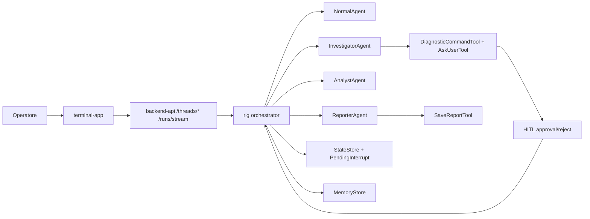
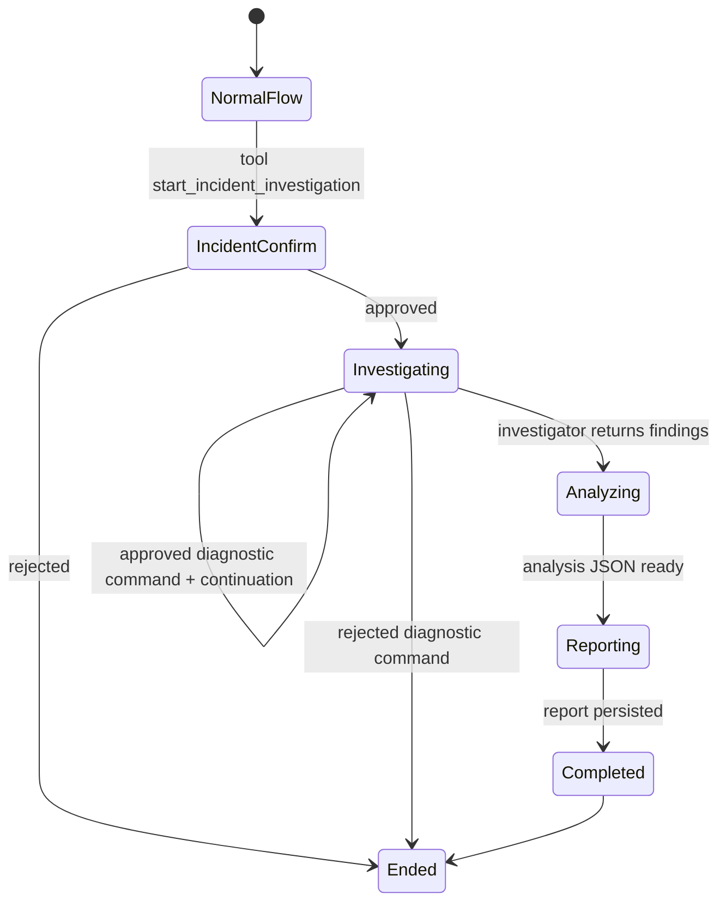
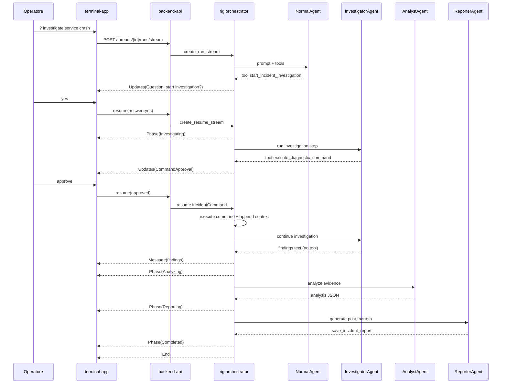
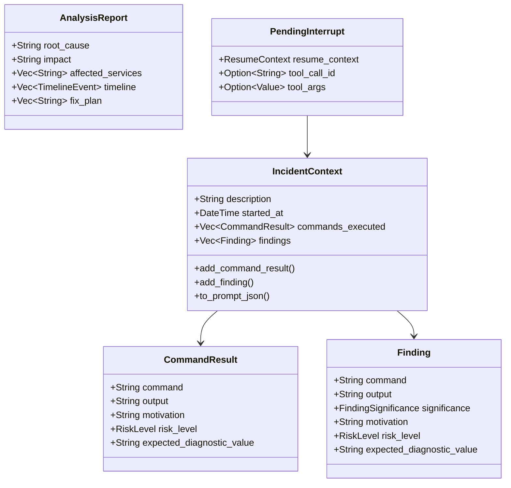
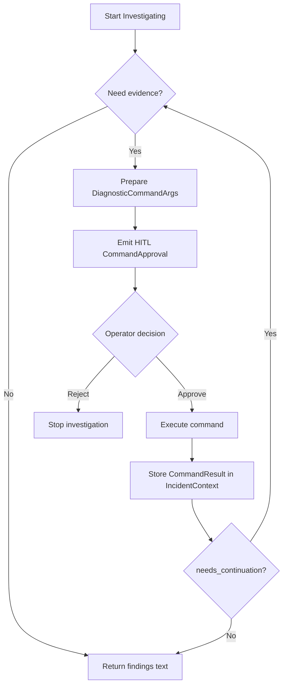

# Whitepaper: Multi-Agent Incident Orchestrator in Infraware Terminal

**Date**: 2026-02-20  
**Status**: Design and implementation deep dive  
**Audience**: Engineering, SRE, architecture review, security review

## 1. Perche' questo documento

Il documento `docs/2026-02-19-incident-pipeline-design.md` definisce il piano operativo.
Questo whitepaper spiega in modo discorsivo e tecnico:

- il modello mentale usato per progettare orchestratore e agenti,
- l'algoritmo di esecuzione end-to-end,
- la logica di arresto/ripresa (HITL),
- il perche' delle scelte architetturali,
- i vincoli di robustezza, sicurezza e mantenibilita'.

Obiettivo pratico: ridurre MTTR mantenendo spiegabilita' e controllo umano.

## 2. Problema che stiamo risolvendo

Nel troubleshooting datacenter multi-cloud, il collo di bottiglia non e' solo "trovare una risposta": e' coordinare
raccolta evidenze, analisi causale, e report post-mortem in un flusso coerente e auditabile.

Un singolo agente generalista tende a mescolare troppi ruoli.
La soluzione adottata e' un orchestratore sequenziale che coordina tre agenti specializzati:

1. **InvestigatorAgent**: raccoglie evidenze operative (CLI/tool), con HITL su ogni comando.
2. **AnalystAgent**: produce root-cause analysis strutturata (senza tool).
3. **ReporterAgent**: produce e salva report post-mortem.

## 3. Architettura ad alto livello



### Osservazione chiave

L'orchestratore non sostituisce il modello: governa il **flusso di controllo** attorno al modello.
Il valore e' nel controllo del ciclo decisionale, non solo nel prompt.

## 4. Algoritmo di orchestrazione

A livello logico, il ciclo e' un finite-state workflow con pause esplicite su interrupt.



### Pseudocodice semplificato

```text
on user_query:
  run NormalAgent (multi_turn=1, with HITL hook)
  if tool=start_incident_investigation intercepted:
    store PendingInterrupt::IncidentConfirmation
    emit HITL question
    stop

on resume(IncidentConfirmation=approved):
  emit phase Investigating
  context = IncidentContext::new(description)
  run InvestigatorAgent

run InvestigatorAgent:
  if execute_diagnostic_command intercepted:
    store PendingInterrupt::IncidentCommand{command + metadata + context}
    emit command approval interrupt
    stop
  else:
    findings_text = assistant response
    run AnalystAgent(context + findings_text)

run AnalystAgent:
  emit phase Analyzing
  analysis_json = model response
  run ReporterAgent(context + analysis_json)

run ReporterAgent:
  emit phase Reporting
  save report via SaveReportTool
  emit phase Completed
  emit End
```

## 5. Sequenza runtime dettagliata



## 5.1 Use case end-to-end: dal prompt alla RCA

Questa sezione mostra un caso reale completo usando la stessa logica descritta sopra.

### Prompt iniziale dell'operatore

```text
? investigate ECS payments crash at 14:00 UTC, users get 503 on checkout
```

### Cosa scatena il prompt (passo per passo)

1. `NormalAgent` interpreta l'intent come incidente operativo e invoca `start_incident_investigation`.
2. `HitlHook` intercetta la tool call, blocca l'esecuzione automatica e genera una domanda HITL:
   - \"Start multi-agent incident investigation?\"
3. L'operatore approva (`yes`), quindi l'orchestratore entra in `Phase::Investigating`.
4. `InvestigatorAgent` propone il primo comando diagnostico tramite `execute_diagnostic_command`, ad esempio:
   - `aws ecs describe-services --cluster prod --services payments`
   - `motivation`: verificare stato del servizio
   - `risk_level`: `low`
   - `expected_diagnostic_value`: capire se task desired/running sono coerenti
5. L'operatore approva; il comando viene eseguito e il risultato viene salvato in `IncidentContext.commands_executed`.
6. Se `needs_continuation=true`, Investigator continua con nuovi comandi (es. eventi ECS, log CloudWatch, health target group) fino a evidenza sufficiente.
7. Quando non servono altri tool, Investigator restituisce findings testuali; l'orchestratore passa a `Phase::Analyzing`.
8. `AnalystAgent` riceve `IncidentContext + findings` e produce JSON RCA (root cause, impact, timeline, fix_plan).
9. L'orchestratore passa a `Phase::Reporting`; `ReporterAgent` produce markdown e invoca `save_incident_report`.
10. Report salvato su disco, emissione `Phase::Completed`, poi `End`.

### Esempio sintetico di output atteso

```text
Phase: Investigating
HITL: approve command aws ecs describe-services ...
HITL: approve command aws logs tail /ecs/payments ...
Phase: Analyzing
RCA: deployment introduced invalid DB endpoint; tasks failed health checks
Phase: Reporting
Report saved: .infraware/incidents/2026-02-20-ecs-payments-503.md
Phase: Completed
```

### Perche' questo use case e' utile

- Rende visibile la catena causale completa (prompt -> tool calls -> evidenze -> RCA -> report).
- Mostra dove avviene il controllo umano e dove avviene l'automazione.
- Permette di misurare MTTR per fase (Investigating / Analyzing / Reporting).

## 6. Modello dati e responsabilita'



### Perche' questi campi sono importanti

`motivation`, `risk_level`, `expected_diagnostic_value` non sono "extra cosmetici":

- rendono ogni comando spiegabile prima dell'esecuzione,
- creano una traccia causale utile per RCA,
- riducono errori operativi durante l'approvazione HITL.

## 7. HITL come meccanismo di sicurezza e governance

Il hook intercetta le tool call ad alto impatto decisionale e blocca l'esecuzione automatica (`cancel_sig`).

Tool intercettati:

- `execute_shell_command`
- `ask_user`
- `start_incident_investigation`
- `execute_diagnostic_command`

Se un tool non e' intercettato quando dovrebbe, il rischio e' che il flusso non si fermi nel punto corretto.
Questo e' uno dei controlli piu' critici in review.

## 8. Gestione errori e fallback logico

Strategia attuale:

1. validazione comandi e blocco pattern pericolosi,
2. timeout bounded durante command execution,
3. resume robusto via `PendingInterrupt` + `ResumeContext`,
4. fallimento fase -> emissione `AgentEvent::Error` + terminazione controllata.

Evoluzione consigliata (P1): fallback per Analyst/Reporter su provider secondario, mai per command execution.

## 9. Diagramma attivita' decisionale (Investigator)



## 10. Pattern di design applicati

- **State Machine**: lifecycle del run incident (`IncidentConfirmation`, `IncidentCommand`, phases).
- **Strategy**: agenti specializzati per compiti distinti.
- **Builder**: costruzione agenti con tool/prompt/config mirati.
- **Adapter**: conversione tool-call -> `PendingInterrupt`/`AgentEvent`.

Questi pattern riducono accoppiamento e facilitano test mirati per fase.

## 11. Allineamento con Microsoft Rust Guidelines

Punti concreti adottati:

- tipi espliciti per eventi e stati (evitare stringly-typed core logic),
- ownership chiara del contesto (`IncidentContext`) in resume,
- confini netti tra dominio (incident), orchestrazione, e trasporto SSE,
- error propagation strutturata (evitare swallow silenziosi),
- test unitari su tool e modelli critici.

Checklist di review consigliata in PR:

1. transizioni di stato complete e non ambigue,
2. nessuna esecuzione tool sensibile senza HITL,
3. serializzazione eventi compatibile e versionabile,
4. no lock lunghi su path async con I/O remoto,
5. test per branch approve/reject/timeout.

## 12. KPI e criteri di successo

Sistema considerato efficace se:

- riduce MTTR almeno del 30% su incidenti comparabili,
- produce RCA completa (Timeline + Root Cause + Fix Plan),
- mantiene tracciabilita' dei comandi approvati/rifiutati,
- evita regressioni di sicurezza nel percorso HITL.

## 13. Limiti attuali e prossimi passi

Limiti noti:

- pipeline sequenziale (no parallel branches),
- report markdown first (JSON esteso previsto in P1),
- quality del reasoning dipendente dal provider LLM.

Prossimi passi tecnici:

1. completare export JSON strutturato in `SaveReportTool`,
2. aggiungere metriche per fase (latenza investigate/analyze/report),
3. introdurre fallback Analyst/Reporter con tracciamento in timeline,
4. estendere test E2E con scenari multi-cloud reali.

## 14. Riferimenti codice

- `crates/backend-engine/src/adapters/rig/orchestrator.rs`
- `crates/backend-engine/src/adapters/rig/incident/mod.rs`
- `crates/backend-engine/src/adapters/rig/incident/agents.rs`
- `crates/backend-engine/src/adapters/rig/incident/context.rs`
- `crates/backend-engine/src/adapters/rig/tools/start_incident.rs`
- `crates/backend-engine/src/adapters/rig/tools/diagnostic_command.rs`
- `crates/shared/src/events.rs`
- `terminal-app/src/llm/client.rs`
- `terminal-app/src/app/llm_event_handler.rs`
